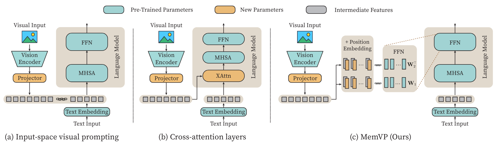

# MemVP
Official code of ''Memory-Space Visual Prompting for Efficient Vision-Language Fine-Tuning''

<p align="left">
<a href="https://arxiv.org/abs/2405.05615" alt="arXiv">
    </a>
</p>

<p align="center">

</p>


## Environment
```shell script
conda create -n memvp python==3.10
conda activate memvp
pip install -r requirements.txt
pip install -e .
```
## TODO 
- [x] Code of experiments on LLaMA.
- [ ] Code of experiments on BART and T5.

## Preparation
- For ScienceQA, please refer to the [official repo](https://github.com/lupantech/ScienceQA).
- For the weights of LLaMA, please refer to the [official form](https://forms.gle/jk851eBVbX1m5TAv5)  or unofficial HuggingFace repo [LLaMA-7B](https://huggingface.co/nyanko7/LLaMA-7B/tree/main) and [LLaMA-13B](https://huggingface.co/TheBloke/llama-13b).

```bash
<your path>/
  |-- memvp
  |-- scripts
  |-- train.py
  |-- eval.py
  ......
  |-- data/
      |-- problem.json
      |-- pid_splits.json
      |-- captions.json
      |-- images
          |-- train          # ScienceQA train image
          |-- val            # ScienceQA val image
          |-- test           # ScienceQA test image
      |-- weights
          |-- tokenizer.model
              |--7B
                  |-- params.json
                  |-- consolidated.00.pth
              |--13B
                  |-- params.json
                  |-- consolidated.00.pth
                  |-- consolidated.01.pth
```

## Fine-Tuning & Inference
```shell script
# LLaMA-7B
bash scripts/finetuning_sqa_7b.sh
bash scripts/eval_sqa_7b.sh

# LLaMA-13B
bash scripts/finetuning_sqa_13b.sh
bash scripts/eval_sqa_13b.sh
```
Fine-tuning takes around 40 minutes for LLaMA-7B and 1 hour for LLaMA-13B on 8x A800 (80G).

[Checkpoints](https://huggingface.co/JieShibo/MemVP-LLaMA-scienceqa/tree/main)


## Acknowledgements

- [LaVIN](https://github.com/luogen1996/LaVIN)
- [LLaVA](https://github.com/haotian-liu/LLaVA)
- [VL-PET](https://github.com/henryhzy/vl-pet)

## Citation

```
@article{jie2024memvp,
  title={Memory-Space Visual Prompting for Efficient Vision-Language Fine-Tuning},
  author={Jie, Shibo and Tang, Yehui and Ding, Ning and Deng, Zhi-Hong and Han, Kai and Wang, Yunhe},
  journal={arXiv preprint arXiv:2405.05615},
  year={2024}
}
```
